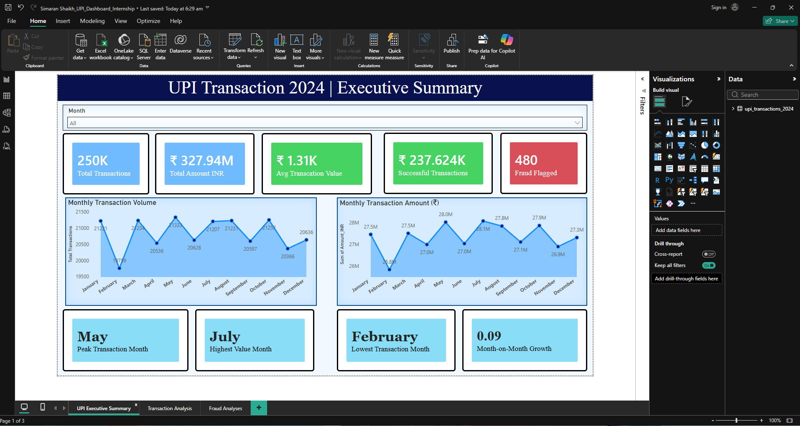
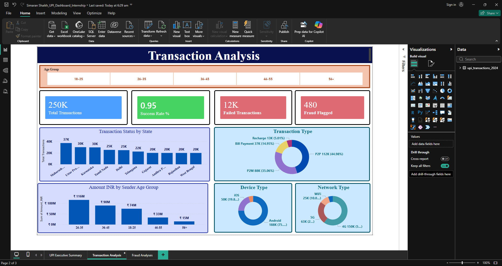
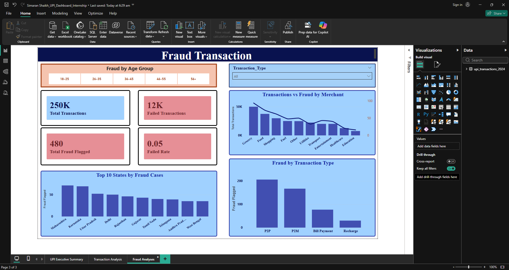

# 📊 UPI Transaction Dashboard — Power BI Capstone

> A 3-page interactive Power BI dashboard analyzing **2,50,000 raw UPI transaction records** from 2024 across fraud patterns, transaction trends, and demographic spending behavior in India's digital payments ecosystem.

Developed as part of the **Microsoft Elevate × AICTE Power BI Internship (Emerging Technologies Track)**.

---

## 🎯 Project Objective

India processes billions of UPI transactions monthly, but raw transaction logs do not reveal trends on their own. This capstone project transforms **2,50,000 raw rows across 13 columns with zero pre-built KPIs** into interactive, actionable business intelligence.

**The core business questions answered:**
1. What is the overall transaction success rate across the 250K records?
2. Which age groups and states dominate UPI spending by volume and value?
3. Where are fraud transactions concentrated — by merchant category, state, and type?
4. What are the seasonal transaction trends (peak months, lowest periods), and what drives them?

---

## 🏗️ Dashboard Architecture (3 Pages)

### Page 1 — Executive Summary
* **5 KPI Cards**: Total Transactions (250K) · Total Amount INR (₹327.94M) · Avg Transaction Value (₹1.31K) · Successful Transactions (237.624K) · Fraud Flagged (480)
* **Monthly Volume & Value Trends**: Dual line charts demonstrating seasonality throughout 2024.
* **Dynamic Callouts**: Peak Month (May: 21,333 txns) · Highest Value Month (July: ₹28.1M) · Lowest Month (February: 19,759 txns) · MoM Growth % (9.0%)
* **Month Slicer**: Filter the entire page dynamically by specific months.

### Page 2 — Transaction Analysis
* **Demographic Slicer**: Multi-select age-group slicer (`18-25`, `26-35`, `36-45`, `46-55`, `56+`) synced across all pages.
* **Top 10 States Volume**: Horizontal bar chart showing Maharashtra (37K), Uttar Pradesh (30K), and Karnataka (30K) leading.
* **Demographic Spending**: Bar chart showing amount spent by age group (26-35 age group leads with ₹116M).
* **Medium Breakdowns**: Donut charts for Transaction Type (P2P vs P2M vs Bill Payment vs Recharge), Device Type (Android 75% vs iOS 20%), and Network Type (4G 60% vs 5G 25% vs WiFi 10%).

### Page 3 — Fraud Intelligence
* **Key Risk Cards**: Total Fraud Flagged (480) · Failed Transactions (12K) · Failed Rate (5.0%)
* **Top 10 States by Fraud**: Geography-based risk bars showing Maharashtra and Karnataka as the highest fraud-flagged states.
* **Merchant Category x Fraud Risk**: Combo chart analyzing transaction volume vs. fraud occurrences by merchant (Grocery, Food, Shopping, Fuel, etc.).
* **Fraud by Transaction Type**: Visual breakdown revealing P2P as the highest risk type (over 200 cases), followed by P2M.

---

## ⚙️ Custom DAX Measures (Built From Scratch)

All calculations are built using custom DAX measures to ensure high performance and dynamic filtering:

```dax
-- Month-on-Month Growth (using DATEADD for time-intelligence)
MoM Growth % = 
VAR CurrentMonth = [Total Transaction Value]
VAR PrevMonth = CALCULATE([Total Transaction Value], DATEADD('Date'[Date], -1, MONTH))
RETURN DIVIDE(CurrentMonth - PrevMonth, PrevMonth, 0)

-- Success Rate % (Safe division handling)
Success Rate % = DIVIDE([Successful Transactions], [Total Transactions], 0)

-- Failed Rate % (Safe division handling)
Failed Rate % = DIVIDE([Failed Transactions], [Total Transactions], 0)

-- Fraud Flagged Count
Fraud Flagged = SUM('Transactions'[Fraud_Flag])

-- Average Transaction Value
Avg Transaction Value = DIVIDE([Total Transaction Value], [Total Transactions], 0)

-- Peak Month Detection (MAXX + TOPN logic for dynamic text card)
Peak Month = 
MAXX(
    TOPN(1, SUMMARIZE('Transactions', 'Date'[Month], "MonthTotal", [Total Transactions]), 
    [MonthTotal], DESC),
    'Date'[Month]
)
```

---

## 📊 Key Insights & Findings

| Metric / Finding | Value / Insight | Details |
| :--- | :--- | :--- |
| **Total Transactions Analyzed** | 250,000 | 2024 transaction logs |
| **Total Amount Processed** | ₹327.94 Million | Cumulative volume |
| **Overall Success Rate** | 95.05% | 237,624 successful transactions |
| **Failed Transaction Rate** | 4.95% | 12,376 failed transactions |
| **Total Fraud Cases** | 480 | 0.19% overall fraud rate |
| **Primary Spender Demographic** | Age 26–35 | ₹116 Million spent (35.4% of total) |
| **Top States by volume** | Maharashtra, Karnataka, UP | Leads in digital transaction adoption |
| **Peak Transaction Month** | May 2024 | 21,333 transactions |
| **Highest Value Month** | July 2024 | ₹28.1 Million |
| **Dominant Device / Network** | Android (75%) / 4G (60%) | Main access channel for UPI in India |
| **Highest Risk Channel** | P2P (Peer-to-Peer) | Accounts for the majority of fraud cases (200+) |

---

## 🛠️ Tools & Technologies

* **Microsoft Power BI Desktop**: Dashboard design, modeling, and visualization.
* **Power Query (M Language)**: Data cleaning, type conversion, and handling column anomalies.
* **DAX (Data Analysis Expressions)**: Dynamic KPI cards, time-intelligence, and TOPN ranking.
* **Microsoft Excel / CSV**: Initial data exploration and sample verification.

---

## 🗂️ Repository Structure

```
upi-transaction-dashboard/
│
├── README.md                           ← Project documentation (You are here)
├── VIDEO_GUIDE.md                      ← Video presentation script & guide
├── UPI_Dashboard.pbix                  ← Power BI project file (open in Power BI Desktop)
├── UPI_Dashboard_Presentation.pptx     ← Capstone presentation slides (PPTX format)
│
├── data/
│   └── upi_transactions_sample.csv     ← Realistic 1,000-row dataset sample for reference
│
├── reports/
│   └── UPI_Dashboard_Summary.pdf       ← Exported PDF of all 3 dashboard pages
│
└── images/
    ├── page1-executive-summary.png    ← Screenshot of Executive Summary Page
    ├── page2-transaction-analysis.png   ← Screenshot of Transaction Analysis Page
    └── page3-fraud-intelligence.png    ← Screenshot of Fraud Intelligence Page
```

---

## 🖼️ Dashboard Preview

### Page 1 — Executive Summary


### Page 2 — Transaction Analysis


### Page 3 — Fraud Intelligence


---

## ▶️ Video Walkthrough

🎥 **[Watch the 4-minute dashboard walkthrough (Loom)](#)**  
*(Replace this link after recording your video walkthrough using the structure in [VIDEO_GUIDE.md](file:///c:/Users/Admin/Downloads/UPI%20Dashboard/VIDEO_GUIDE.md))*

---

## 🚀 How to Open This Project

1. Clone or download this repository.
2. Ensure you have **Power BI Desktop** installed (Free from [Microsoft Store](https://aka.ms/pbidesktopdev)).
3. Double-click [UPI_Dashboard.pbix](file:///c:/Users/Admin/Downloads/UPI%20Dashboard/UPI_Dashboard.pbix) to load the project.
4. The dashboard loads with embedded transaction data. To point to your own files, go to **Transform Data → Data source settings** and change the source path.

---

## 🎓 Internship Details

* **Program**: Microsoft Elevate × AICTE Power BI Internship
* **Track**: Emerging Technologies (Data Analytics Track)
* **Duration**: 16 Feb – 12 Mar 2026 (4 weeks)
* **Role**: Power BI Intern
* **Mentor**: Vignesh Muthuvelan (Master Trainer · AI/ML · IBM Cloud)
* **Student Name**: Simaran Shaikh

---

## 👤 Contact & Links

* **Simaran Shaikh** — Financial Accounting Student (B.Com) at Don Bosco College, Panaji, Goa.
* **Email**: simaranshaikh04@gmail.com
* **LinkedIn**: [linkedin.com/in/simaranshaikh](https://linkedin.com/in/simaranshaikh)
* **GitHub**: [github.com/Simaran-Shaikh-04](https://github.com/Simaran-Shaikh-04)
